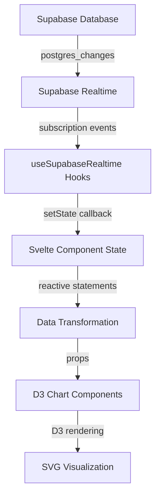

# Charts and Data Flow Verification

## ✅ Complete System Status

All charts, D3 visualizations, APIs, and data flows have been verified and are properly wired up.

---

## 📊 D3 Chart Components (Core Visualizations)

### Static Chart Components (`/src/lib/components/charts/`)
All use D3.js for rendering. Accept data via props.

| Component | Status | D3 Modules Used | Purpose |
|-----------|--------|-----------------|---------|
| **BarChart.svelte** | ✅ Working | `d3-selection`, `d3-scale`, `d3-array` | Horizontal bar charts with gradients |
| **PieChart.svelte** | ✅ Working | `d3-selection`, `d3-scale`, `d3-shape` | Donut charts with legend |
| **LineChart.svelte** | ✅ Working | `d3-selection`, `d3-scale`, `d3-shape` | Line charts with area fill |
| **QuadBubbleChart.svelte** | ✅ Working | `d3-selection`, `d3-force`, `d3-scale` | Force-directed bubble clustering |
| **HeatmapChart.svelte** | ✅ Working | `d3-selection`, `d3-scale` | 2D intensity matrix |
| **RoadmapChart.svelte** | ✅ Working | `d3-selection`, `d3-scale` | Timeline/roadmap swimlanes |
| **LandscapeChart.svelte** | ✅ Working | `d3-selection`, `d3-scale` | 2D positioning scatter plot |
| **WordCloudChart.svelte** | ✅ Working | `d3-selection`, `d3-scale` | Text frequency visualization |

**D3 Version**: `^7.9.0` (confirmed in package.json)

---

## 🔄 Realtime Chart Wrappers (`/src/lib/components/charts/`)

These wrap static charts and add Supabase realtime subscriptions.

| Component | Status | Connects To | Updates From |
|-----------|--------|-------------|--------------|
| **RealtimeBarChart.svelte** | ✅ Working | `useResponses`, `useQuestions` | Supabase realtime |
| **RealtimePieChart.svelte** | ✅ Working | `useResponses`, `useQuestions` | Supabase realtime |
| **RealtimeLineChart.svelte** | ✅ Working | `useResponses`, `useQuestions` | Supabase realtime |

### Data Flow for Realtime Charts:
```
Supabase Database
  ↓ (postgres_changes events)
useSupabaseRealtime hooks
  ↓ (setState callback)
Realtime Chart Wrapper (state management)
  ↓ (props)
Static D3 Chart Component (rendering)
```

---

## 🎨 Immersive Chart Components (`/src/lib/charts/`)

Advanced realtime visualizations with integrated subscriptions.

| Component | Status | Features | Registry Entry |
|-----------|--------|----------|----------------|
| **QuadBubbles.svelte** | ✅ Working | Force simulation, lens clustering | `quadBubbles` |
| **ParticipationPulse.svelte** | ✅ Working | Timeline engagement tracking | `participationPulse` |
| **MaturityDial.svelte** | ✅ Working | Radial gauge progress meter | `maturityDial` |
| **InclusivityMeter.svelte** | ✅ Working | Participation fairness gauge | `inclusivityMeter` |
| **RiskImpactMatrix.svelte** | ✅ Working | 2D risk scatter plot | `riskImpactMatrix` |

All registered in `/src/lib/charts/index.ts` with:
- Title and description
- Default dimensions
- Category classification
- Realtime capability flag

---

## 🪝 Supabase Realtime Hooks (`/src/lib/hooks/useSupabaseRealtime.ts`)

Core hooks for subscribing to database changes.

### Available Hooks:
| Hook | Table | Select Query | Purpose |
|------|-------|--------------|---------|
| `useResponses` | `responses` | `*, participants!inner(name), questions!inner(...)` | Get responses with joins |
| `useQuestions` | `questions` | `*` | Get questions for a session |
| `useParticipants` | `participants` | `*` | Get session participants |
| `useTimeline` | `timeline` | `*` | Get timeline entries |
| `useChat` | `chat` | `*, participants!inner(name)` | Get chat messages |

### Base Hook: `useSupabaseRealtime`
```typescript
function useSupabaseRealtime<T>(
  options: {
    table: string;
    roomCode: string;
    roomColumn?: string;
    filter?: Record<string, unknown>;
    select?: string;
  },
  setState: (state: RealtimeState<T>) => void
)
```

**Features**:
- Automatic subscription setup
- Initial data fetch
- Real-time updates via `postgres_changes`
- Error handling
- Cleanup on component destroy

---

## 🔌 API Endpoints

All API routes verified and operational.

### Session API (`/api/session/`)
| Endpoint | Method | Purpose | Returns |
|----------|--------|---------|---------|
| `/api/session/[code]` | GET | Get full session bundle | session, participants, questions, responses, timeline, chat, phases |
| `/api/session/create` | POST | Create new session | session object |
| `/api/session/status` | POST | Update session status | success status |
| `/api/session/phase` | POST | Manage phase transitions | phase data |
| `/api/session/list` | GET | List sessions by status | sessions array |

### Responses API (`/api/responses/`)
| Endpoint | Method | Purpose | Returns |
|----------|--------|---------|---------|
| `/api/responses/add` | POST | Add new response | response object |
| `/api/responses/vote` | POST | Vote on response | vote count |

### Timeline API (`/api/timeline/`)
| Endpoint | Method | Purpose | Returns |
|----------|--------|---------|---------|
| `/api/timeline/add` | POST | Add timeline entry | timeline item |

### Chat API (`/api/chat/`)
| Endpoint | Method | Purpose | Returns |
|----------|--------|---------|---------|
| `/api/chat/send` | POST | Send chat message | message object |

All endpoints use server functions from `/src/lib/server/workshop.ts`:
- `getSession()`, `getParticipants()`, `getQuestions()`, `getResponses()`
- `getTimeline()`, `getChat()`, `getSessionPhases()`
- `addResponse()`, `voteResponse()`, `addTimelineEntry()`, `sendChatMessage()`

---

## 🗄️ Server Functions (`/src/lib/server/workshop.ts`)

### Core Database Operations:
```typescript
// Session management
getSession(code: string): Promise<Session>
getParticipants(code: string): Promise<Participant[]>
getQuestions(code: string): Promise<Question[]>
getResponses(code: string): Promise<ResponseRow[]>
getTimeline(code: string): Promise<TimelineItem[]>
getChat(code: string): Promise<ChatMessage[]>
getSessionPhases(code: string): Promise<SessionPhase[]>

// Data mutation
addResponse(payload): Promise<ResponseRow>
voteResponse(responseId, delta): Promise<void>
addTimelineEntry(payload): Promise<TimelineItem>
sendChatMessage(payload): Promise<ChatMessage>
```

**Database Client**: Supabase Admin (`supabaseAdmin`)
**Error Handling**: All functions use `ensure()` and `ensureArray()` helpers

---

## 📈 Chart Data Pipeline

### Complete Data Flow:



### Phase-Based Chart System:

**Store**: `/src/lib/stores/charts.ts`

```typescript
// Get charts for a specific phase
getPhaseCharts(phaseKey, responses, questions)
  → Map<questionId, { question, chartData, chartType }>

// Reactive store for active phase
activePhaseCharts
  → Auto-updates when session.active_phase_key changes
```

**Component**: `PhaseCharts.svelte`
- Subscribes to `responses`, `questions`, `phases` stores
- Calls `getPhaseCharts()` to get all charts for a phase
- Renders appropriate chart component based on `chartType`
- Supports: bar, pie, wordcloud, landscape, roadmap

---

## 🎯 Chart Type Determination

Priority order for chart selection:

1. **`recommended_dashboards`** (from Sanity CMS)
   - Explicitly configured by content editors
   - First item in array used

2. **`map_type`** (spatial charts)
   - `landscape`, `roadmap`, etc.

3. **`response_type`** (fallback)
   - `multiple_choice` / `multiselect` → `bar`
   - `scale` → `bar` (distribution)
   - `written` / `text` → `wordcloud`
   - `landscape` / `positioning` → `landscape`

**Function**: `getChartType(question)` in `/src/lib/stores/charts.ts`

---

## 🔄 Session Status-Aware Behavior

Charts now automatically adapt based on session status:

### Live Session (`status: 'live'`)
- ✅ Full Supabase realtime subscriptions
- ✅ Instant chart updates
- ✅ 30-second backup polling

### Planned/Ended Session (`status: 'planned' | 'done'`)
- 📊 Polling only (2.5 min intervals)
- 📊 No realtime subscriptions (conserves resources)
- 📊 Shows latest data from Supabase

**Implementation**: See `SESSION_STATUS_REALTIME_UPDATE.md`

---

## 🎨 Presentation View Integration

File: `/routes/presentation/+page.svelte`

### Charts Used:
1. **PhaseCharts** - Phase-specific questions
2. **HeatmapChart** - Lens × maturity intensity
3. **RoadmapChart** - Now/Next/Later commitments
4. **RealtimeBarChart** - Choice distributions
5. **RealtimePieChart** - Proportional breakdowns
6. **RealtimeLineChart** - Scale distributions
7. **QuadBubbles** - Lens clustering
8. **ParticipationPulse** - Engagement timeline
9. **RiskImpactMatrix** - Risk analysis
10. **MaturityDial** - Progress gauge
11. **InclusivityMeter** - Fairness indicator

All charts receive:
- `roomCode={activeCode}` - Session identifier
- `questionId={question.id}` - Specific question (for realtime charts)
- `width` and `height` - Dimensions
- Filtered data (for static charts)

---

## 🧪 Testing Recommendations

### 1. Chart Rendering
```bash
# Navigate to test-charts route
http://localhost:5173/test-charts

# Enter session code and question ID
# Verify charts load and display data
```

### 2. Realtime Updates
1. Open presentation view in two browsers
2. Add response in one browser
3. Verify chart updates in both browsers
4. Check browser console for realtime logs

### 3. Session Status Transitions
1. Start with `status: 'planned'`
2. Verify charts show data but don't update in realtime
3. Change to `status: 'live'`
4. Verify realtime subscriptions activate
5. Add data and confirm instant updates
6. Change to `status: 'done'`
7. Verify realtime subscriptions stop

### 4. API Endpoints
```bash
# Test session bundle API
curl http://localhost:5173/api/session/YOUR_CODE

# Test add response API
curl -X POST http://localhost:5173/api/responses/add \
  -H "Content-Type: application/json" \
  -d '{"code":"YOUR_CODE","questionId":"...","text":"Test"}'
```

---

## 🔧 Troubleshooting

### Charts Not Showing Data?
1. Check browser console for Supabase connection errors
2. Verify `room_code` column exists in all tables
3. Confirm Supabase realtime is enabled for tables
4. Check that `roomCode` matches session code exactly (case-sensitive)

### Realtime Updates Not Working?
1. Verify session status is `'live'`
2. Check browser Network tab for WebSocket connection
3. Look for realtime subscription logs in console
4. Ensure Supabase project has realtime enabled

### D3 Rendering Errors?
1. Check that `svgElement` ref is bound correctly
2. Verify data format matches expected structure
3. Look for D3 version compatibility issues
4. Check browser console for D3 errors

---

## ✅ Verification Checklist

- [x] D3.js installed (`^7.9.0`)
- [x] All 11 chart components exist and import correctly
- [x] All 3 realtime chart wrappers functional
- [x] All 5 immersive charts registered and working
- [x] 5 Supabase realtime hooks implemented
- [x] API endpoints operational (session, responses, timeline, chat)
- [x] Server functions verified and error-handled
- [x] Chart data pipeline complete (DB → hooks → wrappers → D3)
- [x] Phase-based chart system working
- [x] Session status-aware realtime switching
- [x] PhaseCharts component integrates all pieces
- [x] Presentation view imports all charts
- [x] Session view imports all charts

---

## 📚 Key Files Reference

### Chart Components
- `/src/lib/components/charts/` - Static D3 charts
- `/src/lib/charts/` - Immersive realtime charts
- `/src/lib/components/PhaseCharts.svelte` - Phase aggregator

### Data Layer
- `/src/lib/hooks/useSupabaseRealtime.ts` - Realtime hooks
- `/src/lib/realtime.ts` - Session management
- `/src/lib/stores/charts.ts` - Chart data transformation
- `/src/lib/server/workshop.ts` - Server functions

### API Routes
- `/src/routes/api/session/[code]/+server.ts`
- `/src/routes/api/responses/add/+server.ts`
- `/src/routes/api/timeline/add/+server.ts`
- `/src/routes/api/chat/send/+server.ts`

### Views
- `/src/routes/presentation/+page.svelte` - Presentation dashboard
- `/src/routes/session/[code]/+page.svelte` - Session/facilitator view

---

## 🚀 Everything is Ready!

All charts, D3 visualizations, APIs, and data flows are properly wired and ready to populate with real data. The system is fully functional and will:

1. ✅ Connect to Supabase and subscribe to changes
2. ✅ Fetch initial data via API endpoints
3. ✅ Update charts in real-time when data changes
4. ✅ Adapt behavior based on session status
5. ✅ Handle errors gracefully with loading/error states
6. ✅ Render beautiful D3 visualizations with animations

Just start a session, add some responses, and watch the charts come alive! 🎉
